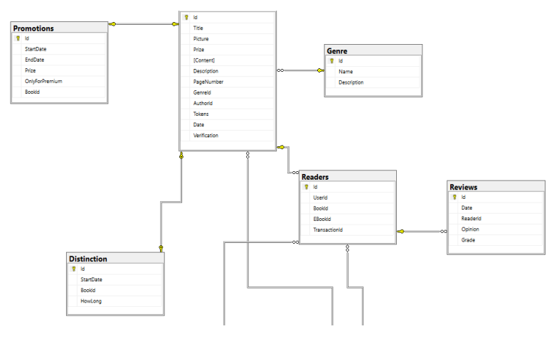
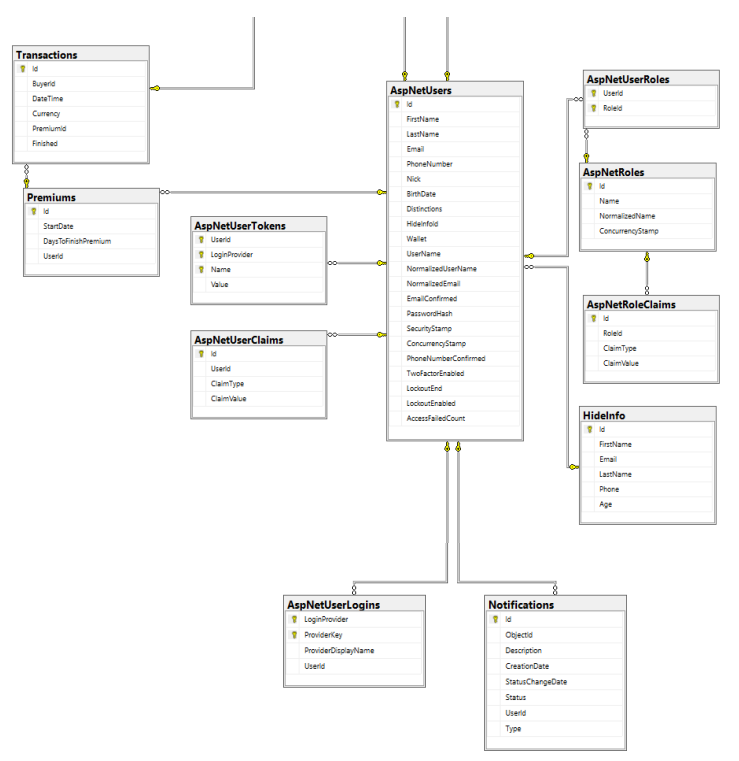
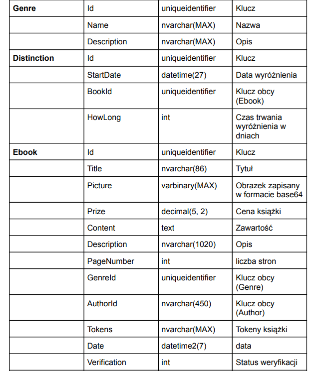
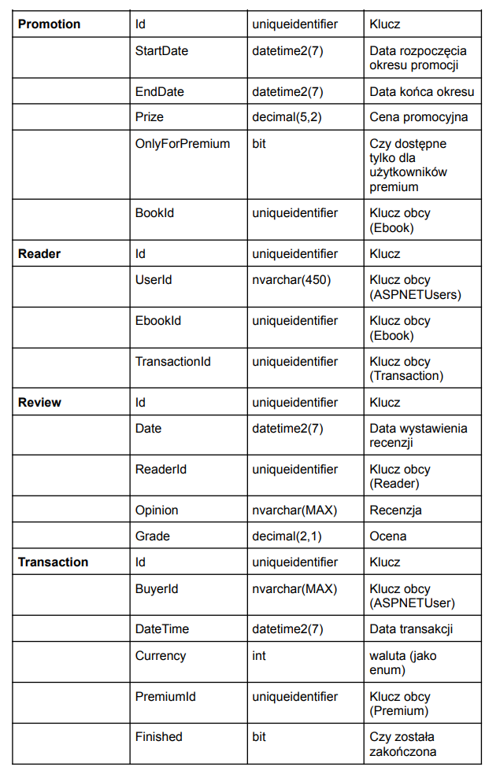
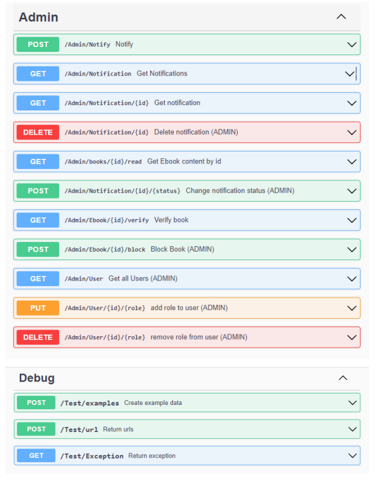
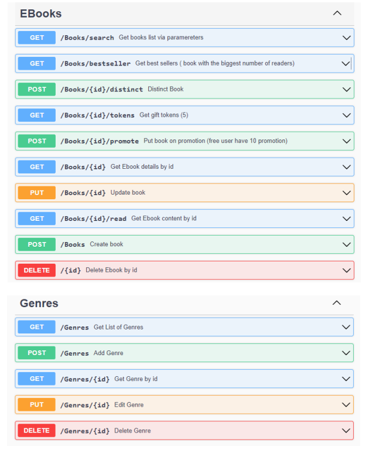
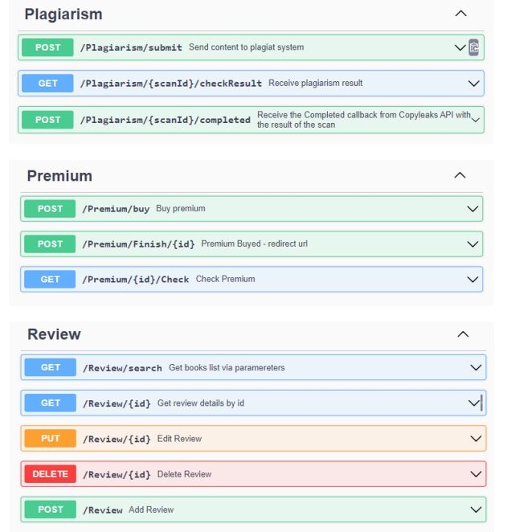
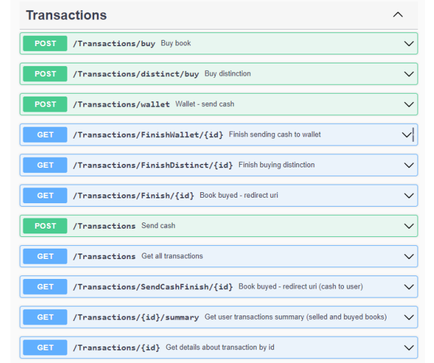
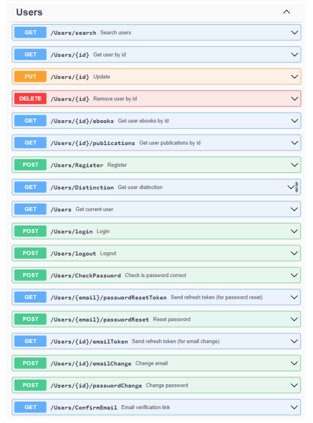

# Księgarnia ebooków (Ebookworld) (06.2023)
Aplikacja została zrealizowana w ramach zajęć projektowych z Zastosowań informatyki w gospodarce na Politechnice Wrocławskiej. Aplikacja Ebookworld ma umożliwić nowym, świeżym autorom osiągnąć sukces na rynku, uzyskać pierwszych czytelników czy recenzje dla swoich książek. Dzięki tej platformie każda pełnoletnia osoba może stać się pisarzem i podzielić się swoją twórczością z innymi. Niezależnie od tego, czy jest ona doświadczonym
autorem, pasjonatem literatury czy początkującym pisarzem, może opublikować swoje dzieło na naszej stronie i udostępnić je czytelnikom.

## Cel projektu
Celem jest projekt, implementacja, testowanie i wdrożenie internetowej księgarni Ebookworld z możliwością sprzedaży własnoręcznie napisanych utworów w formie e-booków w formacie pdf.

## Zakres pracy:
* Projekt:
    * Zdefiniowanie wymagań funkcjonalnych i niefunkcjonalnych,
    * Projekt endpointów,
    * Wykonanie makiet (ang. mockups) widoków interfejsu użytkownika,
    * Zrobienie schematów bazy danych.
* Implementacja:
    * Aplikacja kliencka,
    * Aplikacja serwerowa,
    * Uwierzytelanie i autoryzacja.
* Testowanie:
    * Testy integracyjne kontrolerów oraz serwisów,
* Wdrożenie całego systemu,
* Opracowanie dokumentacji:
    * Prezentacja końcowa,
    * Instrukcje użytkowania,
    * Dokumentacja końcowa.
    
## Zespół:

Uczestnik projektu | Obowiązki             |
-------------------|-----------------------|
 Kamil Dywan       | frontend              |
Damian Janusiak    | backend               |
Bartłomiej Gtfryd  | projekt, dokumentacja |

## Role użytkowników:
* Czytelnik / Autor,
* Administrator.

## Wymagania funkcjonalne:
* Logowanie i rejestacja,
* Edycja konta,
* Tworzenie własnych ebooków,
* Edycja i usuwanie własnych ebooków,
* Wyszukiwanie, filtrowanie i sortowanie ebooków,
* Szczegółowy podgląd ebooka,
* Koszyk,
* Przeprowadzenie transakcji,
* Statystyki autora np. zarobione pieniądze,
* Mechanizm wirtualnego portfela,
* Możliwość wyświetlenia zakupionego ebooka,
* Wyświetlenie historii zakupów,
* Ocenianie ebooków innych użytkowników,
* Wyróżnianie ebooków - lepsze pozycjonowanie i wyraźne graficzne wyróżnienie ebooka,
* Zgłoszenie podejrzenia o plagiat,
* Zarządzanie portalem przez administratora:
    * Możliwość nadawania / odbierania uprawnień administratora lub premium,
    * Podgląd ebooków,
    * Edycja i usuwanie ebooków.
    
## Model biznesowy:
* Prowizja od zakupu książek (10%),
* Płatne konto premium (specjalne promocje oraz darmowe wyróżnienia),
* Wyróżnienia ebooków,
* Reklamy na stronie.
    
## Wymagania niefunkcjonalne:
* Strona jest dostępna w systemie 24/7/365,
* Użytkownik może zmienić rozmiar czcionki i włączyć tryb nocny,
* Użytkownik może wrzucić do 10 własnych e-booków (nie tyczy się użytkowników premium),
* Jest przeprowadzana automatyczna weryfikacja treści e-booków w oparciu o własny prosty oraz zewnętrzny system antyplagiatowy,
* Użytkownik akceptuje regulamin, ponosząc odpowiedzialność za plagiat i oszustwa,
* Technologie:
    * Aplikacja serwerowa:
        * Paradygmat - DDD,
        * Język programowania - C#,
        * Tworzenie aplikacji webowych - ASP .NET Core,
        * Dostęp do danych - Entity Framework Core,
        * Uwierzytelnianie i autoryzacja - ASP. NET Core Identity,
        * PayPal SDK - przeprowadzanie transakcji,
        * Wysyłanie maili -  MailKit,
        * Zewnętrzny system antyplagiatowy - CopyLeaks,
        * Testowanie - XUnit,
        * Mockowanie na potrzeby testowania - Moq,
        * IDE - Visual Studio.
    * Baza danych: T-SQL
    * Aplikacja kliencka:
        * Główny język - TypeScript (rozszerzenie JavaScript),
        * Budowa strony - React,
        * Biblioteka gotowych komponentów - MUI,
        * Zarządzanie odizolowanymi stanami aplikacji - Context API,
        * IDE - Visual Studio Code.
    * Wdrożenie:
        * Aplikacja kliencka i serwerowa - Azure App Service,
        * Baza danych: Azure SQL Database.
    * Inne:
        * Prezentacja - Microsoft Powerpoint,
        * Dokumentacja - Microsoft Word,
        * Przeprowadzenie transakcji - PayPal,
        * Instrukcje użytkownika - Scribe,
        * Specyfikacja API - Swagger.
        
## Architektura aplikacji:
Aplikacja została zrealizowana w architekturze monolitycznej. Aplikacja kliencka jest uruchamiana po stronie aplikacji serwerowej.

## Schemat bazy danych:

    

    

## Tabele bazy danych:

    

    

    

## Specyfikacja API:

    

    

    

    

    

## Zrzuty ekranu:
